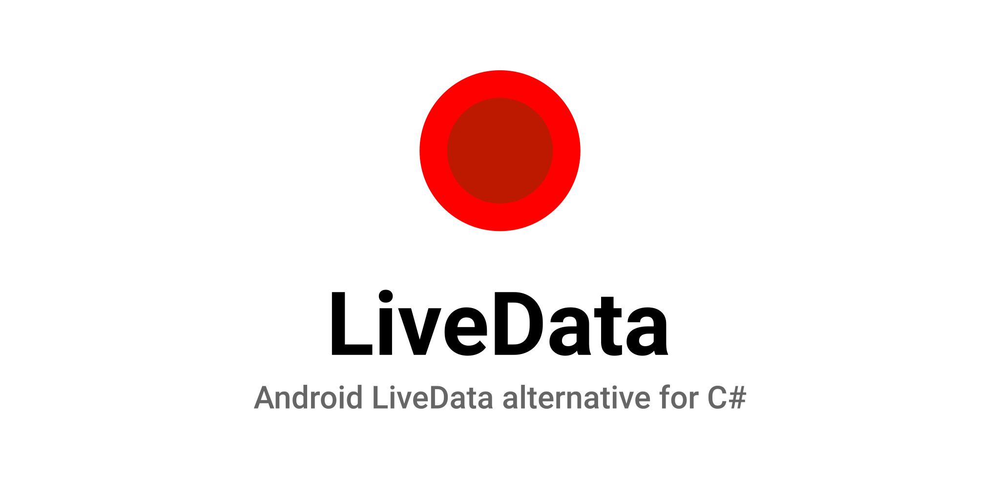

<h1 align="center">LiveData</h1>
<p align="center">
 A simple android LiveData alternative for WPF and C#<br>Easily add reactive properties with a single line of code
</p>
<br>

<p align="center">
  <a href="https://github.com/marplex/LiveData/blob/main/LICENSE"></a>
  <a href="https://www.nuget.org/packages/LiveData/"></a>
  <a href="https://www.nuget.org/packages/LiveData/"></a>
  <a href="https://github.com/Marplex"></a> 
</p>


## Features
✅ Automatically notifies value changes<br/>
✅ Add reactive properties in one line<br/>
✅ Map one LiveData to another<br/>
✅ Convert `Task` to LiveData

## Available for
<br/>
<br/>
<br/>
<br/>
<br/>


## How to use
Use LiveData on your viewmodels, and add rective propeties
```c#
public class MyViewModel : ViewModel {

	public LiveData<string> SearchQuery { get; set; }
	public LiveData<bool> IsVisible { get; set; }
	
	public MyViewModel() {

		SearchQuery = new LiveData<string>("");
		SearchQuery.Value = "myname";
		
		//React to SearchQuery changes and map the value to a boolean.
		//Everything is automatically notified to the UI
		IsVisible = SearchQuery.Map<bool>(it => it != "");
	}
	
}
```
Map to async functions
```c#
IsVisible = SearchQuery.MapAsync<bool>(it => Task.FromResult(true));
```

Bind LiveData to xaml properties
```xml
<!-- Bind the "Value" property -->
<TextBlock Text="{Binding LiveData.Value}" />
```

Extensions further simplify using and transforming livedata objects.

```c#
//Convert task to livedata
var task = Task.FromResult(true);
LiveData<bool> IsVisible = task.ToLiveData<bool>();

//Append, prepend, remove into LiveData of lists
//Changes are notified
LiveData<List<string>> Items;
Items.Remove("first");
Items.Append("first");
Items.Prepend("first");
```

## 📜 License
```xml
Copyright (c) 2022 Marco

Permission is hereby granted, free of charge, to any person obtaining a copy
of this software and associated documentation files (the "Software"), to deal
in the Software without restriction, including without limitation the rights
to use, copy, modify, merge, publish, distribute, sublicense, and/or sell
copies of the Software, and to permit persons to whom the Software is
furnished to do so, subject to the following conditions:

The above copyright notice and this permission notice shall be included in all
copies or substantial portions of the Software.

THE SOFTWARE IS PROVIDED "AS IS", WITHOUT WARRANTY OF ANY KIND, EXPRESS OR
IMPLIED, INCLUDING BUT NOT LIMITED TO THE WARRANTIES OF MERCHANTABILITY,
FITNESS FOR A PARTICULAR PURPOSE AND NONINFRINGEMENT. IN NO EVENT SHALL THE
AUTHORS OR COPYRIGHT HOLDERS BE LIABLE FOR ANY CLAIM, DAMAGES OR OTHER
LIABILITY, WHETHER IN AN ACTION OF CONTRACT, TORT OR OTHERWISE, ARISING FROM,
OUT OF OR IN CONNECTION WITH THE SOFTWARE OR THE USE OR OTHER DEALINGS IN THE
SOFTWARE.```
